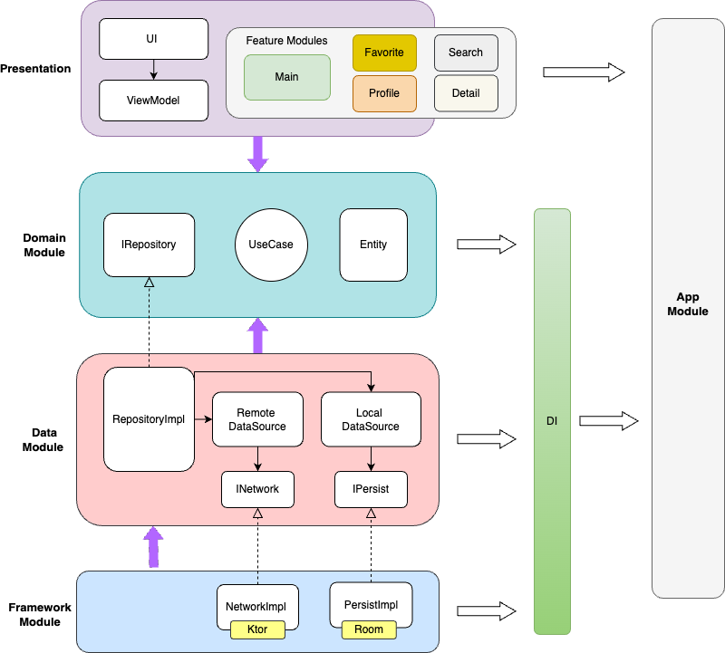
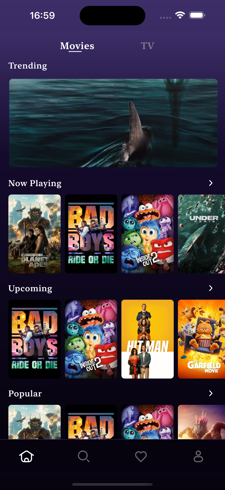

# FlickFusion

Welcome to the FlickFusion repository! 

FlickFusion is an app built using Kotlin Multiplatform (KMP) that leverages the TMDB API to provide movie, TV show, and series fanatics with the latest information on trending, popular, upcoming, on-air, and many other films.

This kotlin-platform project showcases the integration of cutting-edge technologies and demonstrates a sleek UI design using Compose multiplatform, Ktor for network communication, Koin for dependency injection, Voyager for navigation, coil for image loading and also Clean Architecture.  

Supports: Android 📱, iOS📱, Desktop

## Architecture ✨



- **A layered Domain-Driven Design architecture:**
  - **Core Layer:** Contains Domain and Data modules, forming the heart of the business logic.
  - **Framework Layer:** Includes Framework modules (Network and Persist, implementing Data interfaces) for external interactions.
  - **Feature Layer:** Houses Common-UI and Util modules for shared resources, alongside feature-specific modules (Main, Search, Favorite, Detail, Profile).
  - **App Layer:** The topmost layer, orchestrating the entire application.
  - **Key Concepts:**
      - [Domain Driven](https://developer.android.com/topic/architecture/domain-layer) design
      - Modularization
      - Dependency Inversion
      - MVVM Architecture
      - UDF ([Unidirectional Data Flow](https://developer.android.com/develop/ui/compose/architecture#udf-compose)) 

## Tech Stack ✨
- **[Compose Multiplatform](https://www.jetbrains.com/lp/compose-multiplatform/)**  - 100% compose based.
- **[Kotlin Multiplatform](https://kotlinlang.org/docs/multiplatform.html) (KMP)**  -  Enables sharing code across multiple platforms, such as Android, iOS, and the web, ensuring maximum code reuse and efficiency.
- **[Coroutines](https://developer.android.com/kotlin/coroutines) & [Flow](https://developer.android.com/kotlin/flow)**  -  Provides a framework for asynchronous programming and handling streams of data, allowing for efficient, non-blocking code execution.
- **[Ktor](https://ktor.io/docs/client-create-new-application.html)**  -  A Kotlin framework for building asynchronous servers and clients in connected systems, used for handling network operations and API requests.
- **[Koin](https://insert-koin.io/docs/reference/koin-mp/kmp/)**  -  A lightweight dependency injection framework for Kotlin, making it easy to manage dependencies and build testable and maintainable applications.
- **[Coil3](https://coil-kt.github.io/coil/upgrading_to_coil3/)**  -  An image loading library for Android backed by Kotlin Coroutines, offering efficient image loading and caching.
- **[Voyager](https://voyager.adriel.cafe/)**  -  A multiplatform navigation library for KMP, simplifying the implementation of navigation within the app.
- **[Lottie](https://airbnb.io/lottie/#/)**  -  A library for rendering Adobe After Effects animations natively on mobile and web, enhancing the app's UI with high-quality animations.
- **[Kotlin Serialization](https://kotlinlang.org/docs/serialization.html)**  -  A Kotlin library for JSON serialization and deserialization, enabling seamless handling of JSON data.

## Screenshots

<table style="padding:10px">
	<tr>
		<td align="center">
			<h2>Android</h2>
		</td>
		<td align="center">
			<h2>iOS</h2>
		</td>
  	</tr>
	<tr>
    	<td align="center">
			
    	</td>
		<td align="center">
			
    	</td>
  	</tr>
</table>


<table style="padding:10px">
	<tr>
		<td align="center">
			<h2>Desktop</h2>
		</td>
  	</tr>
	<tr>
    	<td align="center">
			
    	</td>
  	</tr>
</table>

## Setup Requirements

Obtain an API key from [TMDB](https://developer.themoviedb.org/reference/intro/authentication
) and add it to your local.properties file:
   ```
   apiKey=your api key
   accountId=your account id
   ```
### Todo
- Unit Tests
- Search module
- persist data
- Error Handling

### Contribute
If you want to contribute to this, you're always welcome!

### License
This project is licensed under the MIT License - see the LICENSE file for details.


